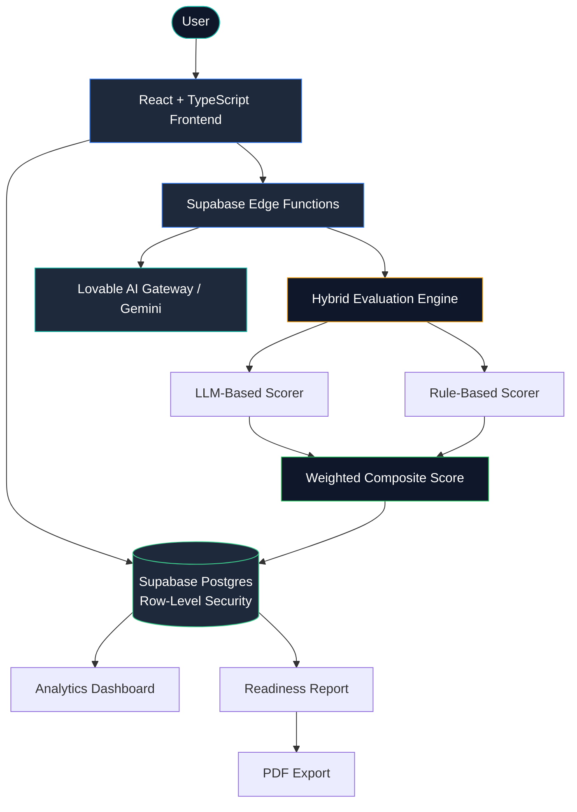
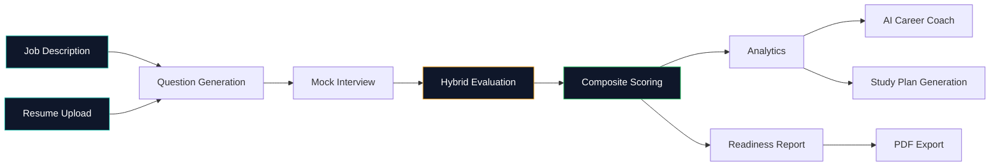

<div align="center">

# 🎯 PrepPilot

### AI-Powered Interview Readiness Analyzer

**Practice smarter. Get evaluated like a real technical interview. Know exactly where you stand.**

[](https://prep-n-apply.lovable.app)
[](https://github.com/Open-Source-Fan/prep-n-apply)
[]()

[](https://react.dev)
[](https://www.typescriptlang.org)
[](https://supabase.com)
[](https://vitejs.dev)

[Live Demo](https://prep-n-apply.lovable.app) · [Features](#-key-features) · [Architecture](#-architecture) · [Getting Started](#-installation)

</div>

---

## 🖼️ Hero Banner

*(Concept brief for a future generated banner — not yet created as an image asset)*

> A dark, futuristic scene with glassmorphism panels floating in layered depth. Center: an abstract stylized AI brain rendered in thin glowing teal/green line-art. Around it, four translucent floating dashboard cards tilted in 3D perspective — a resume-match score, a live voice-interview waveform, an analytics radar chart, and a career roadmap timeline — each softly lit against a near-black navy background. Minimal, confident typography. No literal text or icons crowding the composition — the feeling is "control room for your career," not "marketing collage."

---

## 💡 Problem Statement

Most candidates walk into interviews with no objective signal on how they're actually performing. Interview coaching is expensive, human coaches don't scale, and self-practice with no feedback loop just reinforces bad habits — vague answers, missing structure, no quantified impact.

Existing "practice" tools tend to fall into one of two traps:
- **No evaluation at all** — a static question bank with no feedback on how you actually answered
- **Shallow evaluation** — a single LLM call that returns generic praise ("Great communication skills!") with no measurable signal behind it, and no way to verify the score means anything

Neither gets a candidate closer to knowing, concretely, what to fix before the interview that matters.

## ✅ Solution

PrepPilot runs a full mock interview against a real job description, then evaluates every answer through **two independent scoring systems** — an LLM judging subjective quality, and a deterministic rule engine checking for measurable signals (STAR structure, quantified results, relevant terminology). The two are blended into one transparent score, so the feedback is both nuanced *and* verifiable — not just a confident-sounding number from a single model call.

On top of that, PrepPilot turns a single interview into an ongoing prep system: resume-to-JD matching, a SWOT-style readiness verdict, a phased career roadmap, and day-by-day study plans generated from your actual weak points.

---

## 🚀 Product Overview

PrepPilot is a full-stack, AI-native interview preparation platform. Paste a job description, run a mock interview by text or voice, and receive a readiness report that reads less like a quiz result and more like notes from a senior engineer who sat in on your interview — specific, evidence-based, and actionable.

It was built to prove a point as much as to be useful: that evaluation systems built on a single LLM call are fragile, and that combining LLM judgment with deterministic, auditable signals produces feedback people can actually trust.

---

## ⭐ Key Features

<details open>
<summary><b>🧠 AI & Evaluation</b></summary>

| Feature | Description |
|---|---|
| Hybrid Evaluation Engine | Every answer scored by an LLM (subjective quality) **and** a deterministic rule engine (measurable signals), blended into one transparent composite score |
| Quote-Anchored Feedback | Feedback references your actual phrasing, not generic trait labels |
| STAR-Structure Detection | Behavioral answers checked for Situation/Task/Action/Result and quantified impact — structurally, not just by prompt-asking |
| Content Relevance Scoring | A dedicated dimension measuring how directly an answer addresses the actual question asked |

</details>

<details open>
<summary><b>🎤 Interview Experience</b></summary>

| Feature | Description |
|---|---|
| JD-Driven Question Generation | Paste any job description; questions are generated specifically for that role |
| Multiple Interviewer Styles | Google, FAANG, Startup, Consulting, HR |
| Interview Types | Technical, Behavioral, System Design, Mixed |
| Difficulty Levels | Junior, Mid, Senior, Staff |
| Voice Input | Answer by speaking; transcribed in real time |
| Camera Practice | Live preview with delivery/body-language prompts |

</details>

<details open>
<summary><b>📄 Resume Intelligence</b></summary>

| Feature | Description |
|---|---|
| Resume-to-JD Matching | Percentage match score against any job description |
| Strengths & Skill Gaps | Explicit breakdown of what aligns and what's missing |
| Missing Keyword Detection | Surfaces exact terms an ATS or recruiter would look for |
| Resume Reuse | Upload once, reused across the Resume Analyzer and interview personalization |

</details>

<details open>
<summary><b>📊 Analytics & Career Growth</b></summary>

| Feature | Description |
|---|---|
| Competency Radar | 5-dimension breakdown per interview (Technical Depth, Communication, Problem Solving, Practical Experience, Content Relevance) |
| Score Trends | Progress tracked across all sessions over time |
| SWOT & Readiness | Aggregated, data-driven SWOT verdict across your full interview history |
| Career Roadmap | Phased, week-by-week plan from current role to target role/company |
| Personalized Study Plans | Day-by-day plan targeting your actual weak areas |
| AI Coach | Context-aware chat referencing your real score history and target role |

</details>

<details open>
<summary><b>🔐 Infrastructure & Security</b></summary>

| Feature | Description |
|---|---|
| Server-Side AI Calls | All LLM calls routed through Supabase Edge Functions — no API key ever reaches the client |
| Row-Level Security | Postgres RLS policies scope every query to the authenticated user |
| PDF Report Export | Full readiness report exportable as a shareable PDF |

</details>

---

## 📸 Screenshots

*(Replace the placeholders below with real screenshots from `/docs/screenshots/`)*

| | |
|---|---|
| **Dashboard** — at-a-glance stats, recent sessions, quick actions | `docs/screenshots/dashboard.png` |
| **Interview Setup** — interviewer style, type, and difficulty selection | `docs/screenshots/interview-setup.png` |
| **Live Interview** — question, voice input, camera preview, progress map | `docs/screenshots/live-interview.png` |
| **Readiness Report** — hybrid score breakdown, competency radar, per-question feedback | `docs/screenshots/report.png` |
| **Resume Analyzer** — match score, strengths, skill gaps, missing keywords | `docs/screenshots/resume-analyzer.png` |
| **SWOT & Readiness** — aggregated strengths, weaknesses, opportunities, threats | `docs/screenshots/swot.png` |
| **Career Roadmap** — phased plan toward a target role | `docs/screenshots/roadmap.png` |
| **AI Coach** — context-aware chat | `docs/screenshots/coach.png` |

## 🎬 Demo GIFs

*(Placeholders — record short clips demonstrating each flow)*

- `docs/gifs/question-generation.gif` — pasting a JD and watching role-specific questions generate
- `docs/gifs/voice-interview.gif` — answering a question by voice with live transcription
- `docs/gifs/resume-analysis.gif` — resume-to-JD match score being calculated
- `docs/gifs/analytics.gif` — score trend and skill radar updating across sessions
- `docs/gifs/career-coach.gif` — an AI Coach conversation referencing a real score

---

## 🏗️ Architecture



## 🔄 AI Pipeline



---

## ⚖️ Hybrid Evaluation Engine

The core technical differentiator. Every answer is scored by two **independent** systems, not one:

| | LLM-Based Scoring | Rule-Based Scoring |
|---|---|---|
| **Type** | Subjective, model-judged | Deterministic, code-verified |
| **Measures** | Technical depth, reasoning quality, problem-solving approach, answer maturity, content relevance | STAR structure completeness, keyword/skill coverage, answer length/completeness, named concept & trade-off detection |
| **Output** | 0–100 score + written justification per dimension | 0–100 score per signal, computed via explicit checks |
| **Strength** | Understands nuance, context, and reasoning quality | Catches what LLMs tend to rubber-stamp — vague answers, missing metrics, templated structure |
| **Weight in composite** | 60% | 40% |

**Why this matters:** a single LLM call tends to reward *coherent-sounding* answers even when they're light on substance. The rule-based layer acts as a check against that — in practice, this consistently surfaces a gap between the two scores: LLM-judged quality tends to score noticeably higher than rule-based signals when an answer is well-reasoned but light on quantified results, missing keywords, or incomplete STAR structure. This gap is visible per-question in every generated report, not just in aggregate.

---

## 📁 Folder Structure

*(High-level, representative — see the repository for exact contents)*

```
prep-n-apply/
├── src/
│   ├── components/       # UI components
│   ├── pages/             # Route-level views (Dashboard, Interview, Report, ...)
│   ├── lib/                # Evaluation logic, scoring, utilities
│   └── integrations/     # Supabase client & typed queries
├── supabase/
│   ├── functions/        # Edge Functions (server-side LLM calls)
│   └── migrations/       # Database schema & RLS policies
├── public/                # Static assets
└── package.json
```

---

## 🛠️ Tech Stack

| Category | Technology |
|---|---|
| Frontend | React, TypeScript, Vite |
| Styling | Tailwind CSS |
| Backend | Supabase (Postgres, Row-Level Security, PL/pgSQL) |
| Serverless | Supabase Edge Functions |
| AI / LLM | Lovable AI Gateway, Google Gemini |
| Hosting | Lovable (continuous deploy on push) |
| Package Manager | Bun |

---

## 🔒 Security

- **No client-side API keys** — every AI call is routed through a Supabase Edge Function; the LLM provider key lives server-side only and is never shipped to the browser (verified via full codebase audit)
- **Row-Level Security** — every table query is scoped to the authenticated user via Postgres RLS policies, not application-layer trust
- **Environment separation** — secrets are stored in Supabase's secret manager, not in tracked source files
- **Authentication** — user sessions managed through Supabase Auth

---

## 📦 Installation

```bash
# Clone the repository
git clone https://github.com/Open-Source-Fan/prep-n-apply.git
cd prep-n-apply

# Install dependencies
bun install

# Run the development server
bun dev
```

You'll need your own [Supabase](https://supabase.com) project configured with the appropriate environment variables to run this with full functionality locally.

## ▶️ Usage

1. **Paste a job description** in New Interview → Step 1
2. **Configure your interview** — interviewer style, type, and difficulty
3. **Answer by text or voice**, with optional camera practice
4. **Review your Readiness Report** — hybrid score breakdown, per-question feedback, strengths/weaknesses
5. **Check Resume Analyzer** to match your resume against the same JD
6. **Generate a Career Roadmap or Study Plan** targeting your specific weak areas
7. **Ask the AI Coach** for follow-up guidance grounded in your real performance

---

## 🗺️ Future Roadmap

> Items below are **not yet implemented** — planned directions only.

| Area | Planned Addition |
|---|---|
| MLOps Tooling | MLflow experiment tracking for prompt/evaluation versioning |
| Deployment | Docker containerization for reproducible local/prod parity |
| API Layer | Dedicated FastAPI service layer for evaluation logic |
| Mobile | Native or PWA mobile experience |
| Interview Realism | AI avatar-led interview mode |
| Accessibility | Multilingual interview support |
| Benchmarking | Public, anonymized benchmark scores by role/level |
| Community | Peer/mentor interview marketplace |

---

## 🎯 Why This Project Stands Out

Most AI interview-practice demos wrap a single prompt around a single LLM call and call the output a "score." PrepPilot treats evaluation as a system with two independently verifiable inputs — an LLM's judgment and a deterministic rule engine — because a score a candidate can't audit isn't a score they should trust. The same discipline extends through the product: resume matching, career roadmaps, and study plans are all generated from the same real performance data, not disconnected features bolted on for a longer feature list.

---

## ⚡ Performance Notes

- Hybrid scoring adds a second, deterministic evaluation pass without a second round-trip to the user — both layers run as part of the same evaluation call
- Interview difficulty and focus areas adapt based on uploaded resume content, not just role selection
- Analytics aggregate across all historical sessions, not just the most recent one

---

## 🧩 Challenges Solved

- **Evaluation reliability** — moving from a single subjective LLM score to a hybrid, auditable system
- **Prompt engineering** — tuning the LLM evaluator to produce quote-anchored, specific feedback instead of generic praise
- **Secure architecture** — ensuring zero API key exposure by routing all AI calls server-side through Edge Functions
- **Structured detection** — building deterministic STAR-completeness detection without relying purely on LLM self-report
- **Cross-feature data reuse** — connecting resume, interview, and roadmap data into one coherent user profile instead of siloed tools

---

## 🎓 Learning Outcomes

Building PrepPilot involved end-to-end ownership of an AI product: prompt design and evaluation methodology, server-side architecture for secure LLM integration, relational schema design with row-level access control, and iterative UX refinement based on real usage. It also involved a full lifecycle decision — validating an approach against a specified stack (Python/Streamlit) before committing to a production rebuild — a sequencing choice made deliberately, not by accident.

---

## 🤝 Contributing

This is currently a solo academic/portfolio project. Issues and suggestions are welcome via GitHub Issues.

## 📄 License

Built for educational purposes as part of an academic MLOps course.

## 📬 Contact

Questions or feedback — open an issue on this repository.

---

<div align="center">

Built with ambition, one hybrid score at a time.

</div>
